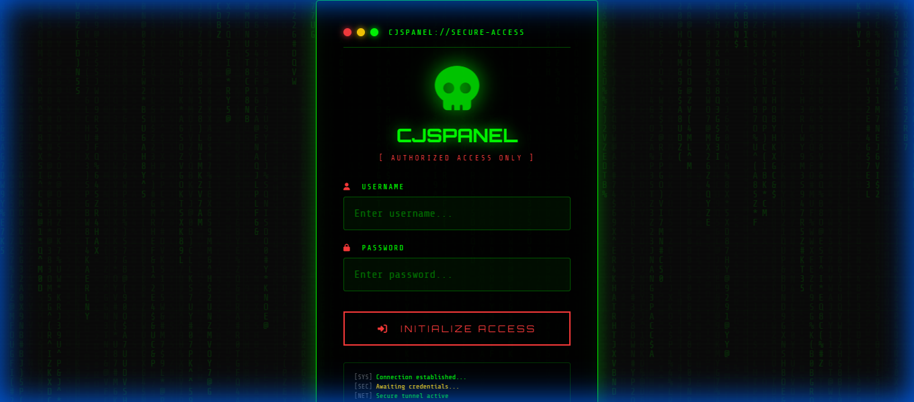

<p align="center">
  
  
  
  
</p>

<p align="center">
  
</p>

<h1 align="center">🖥️ Cjspanel V1</h1>
<h3 align="center">The Ultimate Device Intelligence & Control Platform</h3>

<p align="center">
  <em>A sleek, hacker-themed web panel for real-time device monitoring, data collection, and remote command execution.</em>
</p>

---

## 🎯 What Makes Cjspanel Unique?

<table>
<tr>
<td width="50%">

### 🕶️ **Cyberpunk Aesthetic**

Not just another boring admin panel. Cjspanel features a stunning **Matrix-inspired interface** with:

- Animated matrix rain background
- Neon green/red hacker color scheme
- CRT scanline effects
- Terminal-style typography
- Smooth glowing animations

</td>
<td width="50%">

### ⚡ **Real-Time Control**

Everything happens **live** without page refreshes:

- Instant device connection detection
- Real-time heartbeat monitoring
- Live command execution feedback
- Auto-updating device status
- Console log with activity stream

</td>
</tr>
</table>

---

## 📸 Screenshots

<p align="center">
  
  <br><em>Command Center - Monitor all connected devices at a glance</em>
</p>

<p align="center">
  
  <br><em>System Configuration with Danger Zone for database management</em>
</p>

---

## 🚀 Features at a Glance

### 📱 Device Capabilities

| Feature                | Description                      |
| ---------------------- | -------------------------------- |
| 📍 **GPS Location**    | Get precise device coordinates   |
| 📸 **Camera Capture**  | Front & back camera snapshots    |
| 🎤 **Audio Recording** | Record ambient audio             |
| 🔋 **Battery Status**  | Monitor charge level & status    |
| 📶 **Network Info**    | WiFi, IP, and connection details |
| 💻 **System Info**     | Device specs, OS, browser data   |
| 🌐 **Browser History** | Browsing activity extraction     |

### 🎮 Control Panel Features

| Feature                     | Description                              |
| --------------------------- | ---------------------------------------- |
| 🎯 **Multi-Device Support** | Monitor unlimited devices simultaneously |
| ⚡ **One-Click Payload**    | Generate hooks instantly                 |
| 📊 **Live Statistics**      | Real-time connection metrics             |
| 📁 **Data Vault**           | Organized storage for collected data     |
| 🗑️ **Easy Cleanup**         | Delete individual or all devices         |
| 🔐 **Secure Sessions**      | Enterprise-grade authentication          |

---

## 🔒 Security First

Cjspanel isn't just powerful—it's **secure by design**:

```
🛡️ Password Hashing      → PBKDF2-SHA256 (260,000 iterations)
🚦 Rate Limiting         → Protection against brute force
🍪 Secure Cookies        → HttpOnly, SameSite, Secure flags
🧹 Input Sanitization    → XSS and injection prevention
🔑 API Key Auth          → For automated integrations
📋 UUID Validation       → Strict device ID verification
```

---

## ⚡ Quick Start

### 🪟 Windows

```batch
# Just double-click!
start.bat
```

### 🐧 Linux / 🍎 macOS

```bash
chmod +x start.sh
./start.sh
```

### 📦 Manual Setup

```bash
# Clone the repo
git clone https://github.com/chetancj1212/cjspanel.git
cd cjspanel

# Create virtual environment
python -m venv venv
source venv/bin/activate  # Linux/Mac
.\venv\Scripts\activate   # Windows

# Install dependencies
pip install -r requirements.txt

# Launch!
python main.py
```

---

## 🌐 Deployment

### Deploy to Render (Recommended - Free!)

1. **Fork** this repository
2. Go to [Render.com](https://render.com) → **New Web Service**
3. Connect your GitHub → Select `cjspanel`
4. Render auto-detects `render.yaml` ✨
5. Add environment variables:
   ```
   ADMIN_USERNAME = YourSecureUsername
   ADMIN_PASSWORD = YourSecurePassword123!
   PRODUCTION = true
   ```
6. **Deploy!** 🚀

Your panel will be live at: `https://cjspanel.onrender.com`

---

## 🔐 Default Credentials

| Field        | Value      |
| ------------ | ---------- |
| **Username** | `Chetancj` |
| **Password** | `Chetancj` |

> ⚠️ **Change these immediately after first login!**

---

## 🏗️ Project Structure

```
cjspanel/
├── 🐍 main.py              # Core application (security-hardened)
├── 📦 requirements.txt     # Dependencies
├── 🚀 render.yaml          # Render deployment config
├── 🪟 start.bat            # Windows launcher
├── 🐧 start.sh             # Linux/Mac launcher
├── 📁 templates/           # Hacker-themed UI
│   ├── login.html          # Matrix rain login
│   ├── dashboard.html      # Command center
│   ├── gallery.html        # Data vault
│   ├── settings.html       # System config
│   └── ...
├── 📸 screenshots/         # README images
└── 📁 data/               # Captured device data
    └── devices/           # Organized by device ID
```

---

## 🎨 Customization

### Change the Theme Colors

Edit `templates/dashboard.html`:

```css
:root {
  --green: #00ff00; /* Primary accent */
  --red: #ff3b3b; /* Warning/danger */
  --bg-dark: #0a0a0a; /* Background */
}
```

### Add New Commands

Edit `main.py` → `execute_command()` function to add custom device actions.

---

## ⚠️ Disclaimer

> This tool is intended for **authorized security testing and educational purposes only**.
> Always obtain proper authorization before testing on any device.
> The developer is not responsible for any misuse of this software.

---

## 📝 License

This project is for educational purposes only.

---

<p align="center">
  <strong>Built with 💚 by Chetancj</strong><br>
  <em>Making security testing beautiful</em>
</p>

<p align="center">
  <a href="https://github.com/chetancj1212/cjspanel">⭐ Star this repo if you find it useful!</a>
</p>
